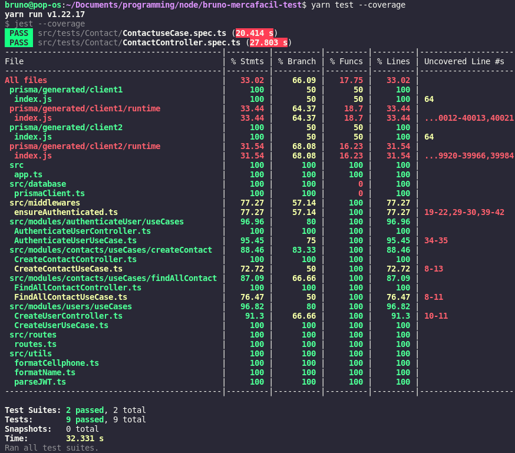
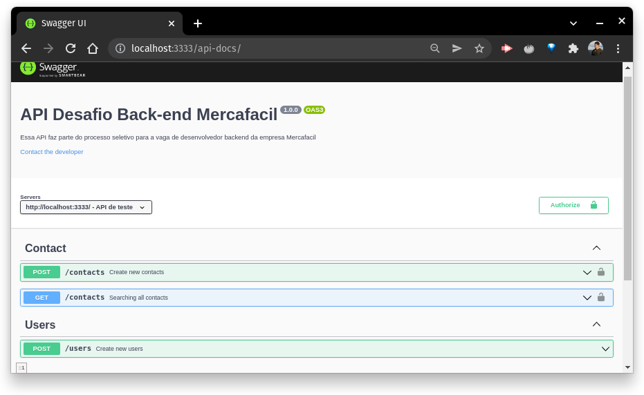
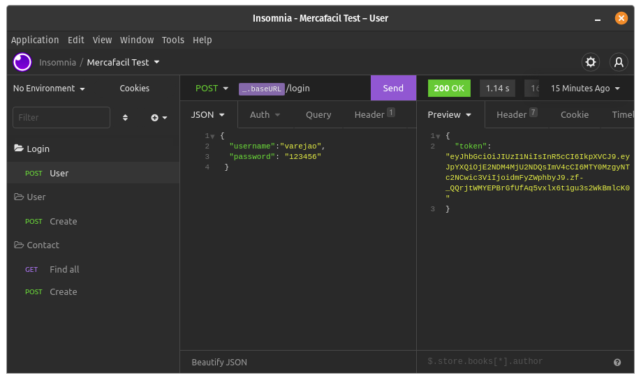

# Desafio técnico Mercafacil - Desenvolvedor Backend


## Passos para execução do projeto

```
$ git clone https://github.com/brunocoelhor/bruno-mercafacil-test.git
```
### Após clonar o repositório entrar no diretório do projeto e executar os seguintes comandos no terminal

### Comando para subir as imagens do docker com o banco de dados Postgres e MySQL.
```
$ docker-compose up -d
```

### Comando para baixar as dependências necessárias para o funcionamento do projeto.
```
$ yarn
ou
$ yarn install
ou
$ npm install
```
### Comando para gerar o PrismaClient, é necessário gerar os clients dos dois databases.

```
yarn prisma generate --schema prisma/pg.prisma
yarn prisma generate --schema prisma/mysql.prisma
``` 

### Comando para a criação de tabelas e inclusão de dados no Postgres e MySQL. Neste comando é necessário colocar o nome da migration que está sendo criada, para identificação futura caso necessário.

É necessário remover os arquivos da criação da primeira migrate conforme informado na [documentação do prisma](https://www.prisma.io/docs/concepts/components/prisma-migrate/prisma-migrate-limitations-issues#you-cannot-automatically-switch-database-providers).
```
$ yarn prisma migrate dev --schema=./prisma/pg.prisma

$ rm -rf prisma/migrations/*

$ yarn prisma migrate dev --schema=./prisma/mysql.prisma
```
### Comando para começar a rodar o programa em ambiente de desenvolvimento.
```
$ yarn dev
```
### Criar os usuários Varejão e Macapá pela rota  http://localhost:3333/users

```
{
	"name":"Varejão",
	"username":"varejao",
	"password": "123456"
 }

 {
	"name":"Macapa",
	"username":"macapa",
	"password": "123456"
 }
```


### Comando para executar os testes desenvolvidos para o projeto.
```
$ yarn test
ou
$ yarn test --coverage
```


### É possível ainda acessar a documentação da aplicação desenvolvida no endereço

```
http://localhost:3333/api-docs/
```



### Comando para build e rodar a aplicação

```
$ yarn build

$ node ./dist/server.js
```

## Tecnologias utilizadas

- NodeJS 16.13.2
- ExpressJS 4.17.2
- Typescript 4.5.4
- Prisma 3.8.1
- PostgresSQL
- MySQL
- Jest 27.4.7
- Supertest 6.2.2
- swagger-ui-express 4.3.0
- bcryptjs
- jsonwebtoken
---

O arquivo `insomnia_bruno_mercafacil.json` tem a exportação para execução das rotas para testes no programa [Insominia](https://insomnia.rest/download)
---



## Rotas - Mais detalhes das rotas pode ser visto na documentação no [SWAGGER](http://localhost:3333/api-docs/)

---
[POST] `http://localhost:3333/login` - Login do usuário para realizar operações no sistema (username: varejo/macapa - password:123456 )

[POST] `http://localhost:3333/users` - Criação de um novo usuário. 
{
    "name":"Novo Usuário",
    "username":"novousuario",
    "password": "123456"
}

[POST] `http://localhost:3333/contacts` - Cadastro de novos contatos, necessita de authorização
{
	"contacts": [
			{
					"name": "Marina Rodrigues 12222ww",
					"cellphone": "(55) 41 99694-1919"
			},
			{
					"name": "123123123 212www",
					"cellphone": "5541954122723"
			}
	]
}

[GET] `http://localhost:3333/contacts` - Lista todas as cidades cadastradas para o usuário, necessita de authorização.

---